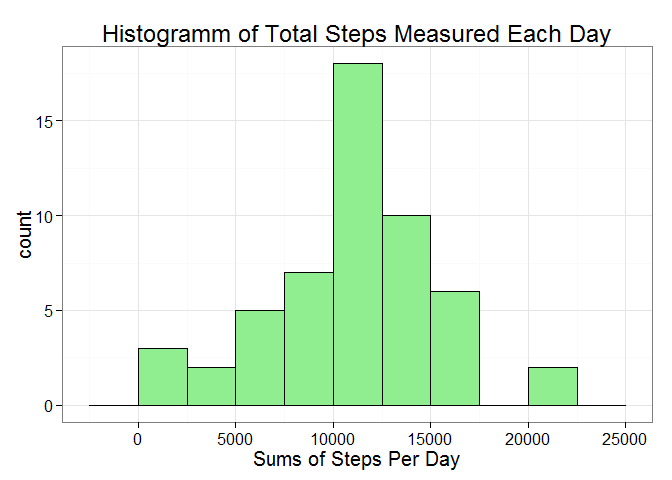
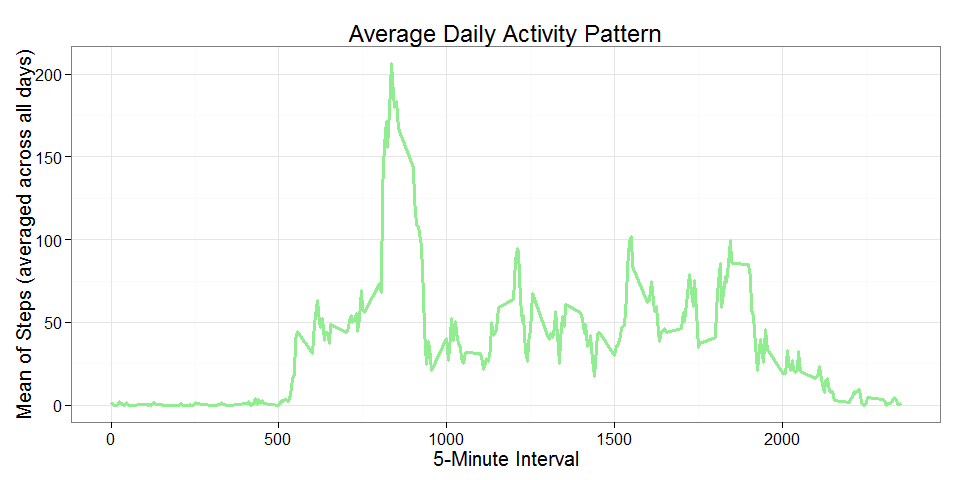
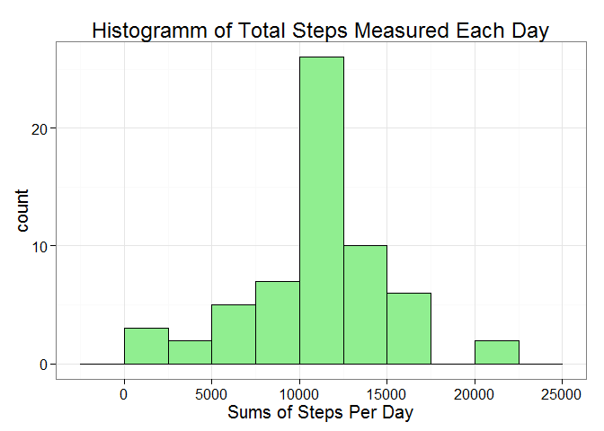
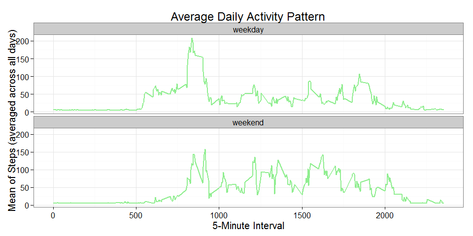

Reproducible Research: Peer Assessment 1
========================================================

It is now possible to collect a large amount of data about personal movement using activity monitoring devices such as a Fitbit, Nike Fuelband, or Jawbone Up. These type of devices are part of the "quantified self" movement - a group of enthusiasts who take measurements about themselves regularly to improve their health, to find patterns in their behavior. 

This assignment makes use of data from a personal activity monitoring device. This device collects data at 5 minute intervals through out the day. The data consists of two months of data from an anonymous individual collected during the months of October and November, 2012 and include the number of steps taken in 5 minute intervals each day.  
  
  

## Loading and preprocessing the data
Setting local time aspects of the system to default ("C" for North-American standard) for reproducibility purposes:

```r
Sys.setlocale("LC_TIME", "C")
```

```
## [1] "C"
```

The data file is downloaded if it is not present and stored into an object named 'AcMon':

```r
read_data <- function() {
    con = "activity.csv"
    if (!file.exists(con)){
      file = "activity.zip"
      url = "https://d396qusza40orc.cloudfront.net/repdata%2Fdata%2Factivity.zip"
      if (!file.exists(file)) {
        download.file(url, destfile = file, method = "curl")
        }
      con <- unz(file, "activity.csv")
    }
    data <- read.csv(con, header = T) 
}

AcMon <- read_data()
```

Examine the resulting data structure:

```r
str(AcMon)
```

```
## 'data.frame':	17568 obs. of  3 variables:
##  $ steps   : int  NA NA NA NA NA NA NA NA NA NA ...
##  $ date    : Factor w/ 61 levels "2012-10-01","2012-10-02",..: 1 1 1 1 1 1 1 1 1 1 ...
##  $ interval: int  0 5 10 15 20 25 30 35 40 45 ...
```

Looks good. Yet, the type of the variable 'date' should be date instead of factor:

```r
AcMon$date <- as.Date(AcMon$date)
```

Examine the resulting data structure again:

```r
str(AcMon)
```

```
## 'data.frame':	17568 obs. of  3 variables:
##  $ steps   : int  NA NA NA NA NA NA NA NA NA NA ...
##  $ date    : Date, format: "2012-10-01" "2012-10-01" ...
##  $ interval: int  0 5 10 15 20 25 30 35 40 45 ...
```

Apparently, we successfully produced a data frame with which we can work properly, so we can continue doing calcuations on it in order to answer questions on the activity pattern of the subject from which measurements were taken.  


## What is the mean total number of steps taken per day?

To answer this first question, we produce a histogram of the total number of steps measured each day and  additionally report the mean and median total number of steps taken per day.

For both this tasks we first need to sum up the steps for each date. We therefore use the `aggregate()` function:


```r
sumsAcMon <- aggregate(steps ~ date, data = AcMon, FUN = sum, na.rm=T)
```

Afterwards we can plot the histrogram...


```r
library(ggplot2) #loading the ggplot2 package 

ggplot(data=sumsAcMon, aes(x=steps)) + 
  xlab("Sums of Steps Per Day")+ 
  geom_histogram(fill= 'lightgreen', colour='black', binwidth=2500) +
  labs(title = "Histogramm of Total Steps Measured Each Day") +
  theme_bw(base_family = "Avenir", base_size = 15)
```

 

...and report the mean...

```r
mean(sumsAcMon[,2])
```

```
## [1] 10766
```

...and median of daily steps:

```r
median(sumsAcMon[,2])
```

```
## [1] 10765
```
  

## What is the average daily activity pattern?

To answer this, we make a time series plot (i.e. type = "l") of the 5-minute interval (x-axis) and the average number of steps taken, averaged across all days (y-axis) and report the 5-minute interval which on average contains the maximum number of steps.

Again we first have to apply the aggregate() function; this time to calculate the mean of steps for each interval:

```r
AcTimes <- aggregate(steps ~ interval, data = AcMon, FUN = mean)
```

For plotting we use the gglot() function again, but this time applying a line geom:

```r
ggplot(data=AcTimes, aes(x=interval, y=steps)) + 
  xlab("5-Minute Interval")+ 
  geom_line(colour= 'lightgreen', size=1.1) +
  ylab("Mean of Steps (averaged across all days)") + 
    labs(title = "Average Daily Activity Pattern") +
  theme_bw(base_family = "Avenir", base_size = 15)
```

 

The 5-minute interval which on average contains the maximum number of steps can be called this way:

```r
AcTimes$interval[which(AcTimes[,2]==max(AcTimes$steps))]
```

```
## [1] 835
```

Alternatively, we can use an even shorter expression to call this proper interval alongside its corresponding value:

```r
AcTimes[which(AcTimes[,2]==max(AcTimes$steps)),]
```

```
##     interval steps
## 104      835 206.2
```
So, on average the maximum number of steps in an interval is 206 and this maximum occurs in the **835th** interval, or, but differently, at 8.35 o'clock.  


## Imputing missing values

The presence of missing data may introduce bias into some calculations. Therefore I checked which variables contained missing values:

```r
any(is.na(AcMon[,1]))
```

```
## [1] TRUE
```

```r
any(is.na(AcMon[,2]))
```

```
## [1] FALSE
```

```r
any(is.na(AcMon[,3]))
```

```
## [1] FALSE
```

Since only the first expression returns the value 'TRUE', we can infer that only the first column, namely the variable 'steps' is flawed with missings.

To assess the extent of flawed data, we also calculate the sum of these NAs:

```r
sum(is.na(AcMon[,1]))
```

```
## [1] 2304
```

As 2304 is a fairly large number, we create a new dataset that is equal to the original dataset but with the missing data filled in.
This filling in was done by **simply replacing NAs with the mean measurement of steps**:

```r
AcMon2 <- AcMon
AcMon2[is.na(AcMon2)] <- mean(AcMon2$steps, na.rm=T)
```

Anyway, re-producing the prior histogram with the imputed values, we get a rather similar result: 

```r
sumsAcMon2 <- aggregate(steps ~ date, data = AcMon2, FUN = sum)
```

```r
ggplot(data=sumsAcMon2, aes(x=steps)) + 
  xlab("Sums of Steps Per Day")+ 
  geom_histogram(fill= 'lightgreen', colour='black', binwidth=2500) +
  labs(title = "Histogramm of Total Steps Measured Each Day") +
  theme_bw(base_family = "Avenir", base_size = 15)
```

 

However, a slight change can be observed when we take a closer look at the data. Because mean and median are now identical:

```r
mean(sumsAcMon2[,2])
```

```
## [1] 10766
```


```r
median(sumsAcMon2[,2])
```

```
## [1] 10766
```
  

## Are there differences in activity patterns between weekdays and weekends?

This question can be addressed by creating a new factor variable "typeoday" in the dataset with two levels - "weekday" and "weekend" indicating whether a given date is a weekday or weekend day:

```r
AcMon2$weekday <- weekdays(AcMon2$date)
AcMon2$typeoday[AcMon2$weekday== "Saturday" | AcMon2$weekday== "Sunday"] <- 'weekend'
AcMon2$typeoday[AcMon2$weekday!= "Saturday" & AcMon2$weekday!= "Sunday"] <- 'weekday'
AcMon2$typeoday <- as.factor(AcMon2$typeoday)
```

For comparing the time series for both types of days, we first have to aggregate the data, again. This time steps are aggregated by two variables, by day type and be interval:

```r
AcTimes2 <- aggregate(AcMon2$steps, by=list(daytype=AcMon2$typeoday, interval= AcMon2$interval), FUN = mean)
```

To be cautious, we should check if the resulting data structure looks as it should:

```r
head(AcTimes2)
```

```
##   daytype interval     x
## 1 weekday        0 7.007
## 2 weekend        0 4.673
## 3 weekday        5 5.384
## 4 weekend        5 4.673
## 5 weekday       10 5.140
## 6 weekend       10 4.673
```

Since it does we can redraw the time series plot from above with the imputed data, but this time facetting over the 'typeoday' variable:

```r
ggplot(data=AcTimes2, aes(x=interval, y=x)) + 
  xlab("5-Minute Interval")+ 
  geom_line(colour= 'lightgreen', size=1) +
  facet_wrap(~ daytype, nrow = 2) + ylab("Mean of Steps (averaged across all days)")+ 
  labs(title = "Average Daily Activity Pattern") +
  theme_bw(base_family = "Avenir", base_size = 15)
```

 
The plot shows that activity on weekdays tends start earlier (around the 600 interval) and alternates more across the day (with a strong peak of more than 200 steps on average around the 850 inverval but rather moderate values across the rest of the day). On weekendy, on the other hand, acitity evolves later and never raises higher than 155 steps per interval but remains relatively high values until the evening (2000 inverval).
